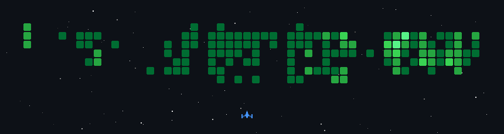

 

<h1>💡 Projects</h1>

| 프로젝트 명 | 주요 작업 | 기술 스택 | 기간 / 링크 |
| :--- | :--- | :--- | :--- |
| 🚀 **Taken Seat** (공연 예매 플랫폼) | 티켓 예매 API 및 결제 도메인 구현 Redis 기반 조회/처리 최적화 Kafka 비동기 메시징 적용 | `Spring Boot` `Redis` `Kafka` `MySQL` | 25.04 - 25.05 [🔗 GitHub](https://github.com/jjsh0208/TakenSeat) |
| 💻 **DeliverySquad 10** (B2B 물류/배송 플랫폼) | MSA 기반 결제 서비스 구현 Redis 분산 락 및 RabbitMQ 메시징 적용 Saga 기반 분산 트랜잭션 처리 | `Spring Boot` `RabbitMQ` `Redis` `PostgreSQL` | 25.03 [🔗 GitHub](https://github.com/jjsh0208/b2b-service-platform) |
| 🌱 **Onnongwa** (농촌 체험 플랫폼) | OpenAI API 기반 AI 기능 구현 사용자 맞춤형 추천 기능 개발 Elasticsearch 기반 검색 기능 구현 | `Spring Boot` `Elasticsearch` `OpenAI API` `MySQL` `Docker` | 25.08 - 25.10 [🔗 GitHub](https://github.com/Onnongwa/Onnongwa) |
| 📦 **주문의 민족** (배달 주문 플랫폼) | Spring Security 기반 인증/인가 구현 JWT Access/Refresh Token 적용 GitHub Actions 기반 CI/CD 구성 | `Spring Boot` `Spring Security` `JWT` `Docker` | 25.02 [🔗 GitHub](https://github.com/jjsh0208/delivery) |

 

<h1>🔥 Core Engineering (Trouble Shooting)</h1>

| 엔지니어링 주제 | 주요 내용 및 해결 방안 | 관련 링크 |
| :--- | :--- | :--- |
| ⚡ **아키텍처 & 동시성** 대규모 트래픽 격리 및 동시성 제어 | RabbitMQ 파티션 큐 분산 라우팅 및 Redis 분산 락(Redisson)을 통한 Hot Key 병목 해소 | [Wiki 보기](https://github.com/DevSquad10/b2b-service-platform/wiki) |
| 🚀 **데이터베이스** 대용량 데이터 조회 성능 최적화 | 복합 인덱스 설계 및 Redis Pipeline을 활용한 조회·집계 성능 최적화 | [Blog 보기](https://ddong-kka.tistory.com/61) |
| 🔄 **MSA & 트랜잭션** Saga Pattern 재시도 제어 | Redis 멱등성 키와 DLQ를 활용한 보상 트랜잭션 및 재시도 처리 | [Blog 보기](https://ddong-kka.tistory.com/27) |
| 🏛️ **도메인 설계** 결제 시스템 책임 분리 | 외부 API 연동 계층과 핵심 도메인 로직을 분리하여 결제 프로세스의 책임 구조 개선 | [Blog 보기](https://ddong-kka.tistory.com/36) |
 

<h1>💡 Coding Habits</h1>

  

  

  
  

<!-- <h1>🎧 Now Playing</h1>

 -->
